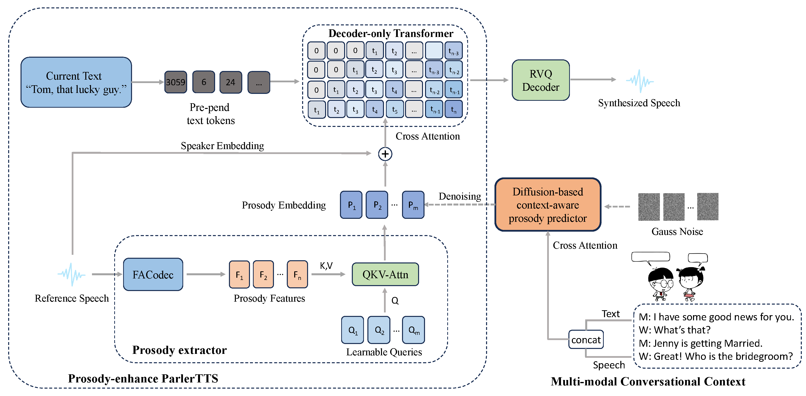

# DiffCSS: Diverse and Expressive Conversational Speech Synthesis with Diffusion Models

### *Weihao Wu, Zhiwei Lin, Yixuan Zhou, Jingbei Li, Rui Niu, Qinghua Wu, Songjun Cao, Long Ma, Zhiyong Wu*

<h2 id = "1">Abstract</h2>
Conversational speech synthesis (CSS) aims to synthesize both contextually appropriate and expressive speech, and considerable efforts have been made to enhance the understanding of conversational context. However, existing CSS systems are limited to deterministic prediction, overlooking the diversity of potential responses. Moreover, they rarely employ language model (LM)-based TTS backbones, limiting the naturalness and quality of synthesized speech. To address these issues, in this paper, we propose DiffCSS, an innovative CSS framework that leverages diffusion models and an LM-based TTS backbone to generate diverse, expressive, and contextually coherent speech. A diffusion-based context-aware prosody predictor is proposed to sample diverse prosody embeddings conditioned on multimodal conversational context. Then a prosody-controllable LM-based TTS backbone is developed to synthesize high-quality speech with sampled prosody embeddings. Experimental results demonstrate that the synthesized speech from DiffCSS is more diverse, contextually coherent, and expressive than existing CSS systems

    
	
    
     
    
 
    <b>Fig.1</b>: Overall architecture of the proposed CSS framework
    

## Synthesized samples
### Sample 1
#### Context
B: as an author!  
B: i'm quite talented.  
B: my literature professor at university used to encourage me.  
A: this is not a school, mrs lee!  
A: i got in touch with you to speak to you about our marketing office!  
<audio controls="controls" src="./data/context/9_1_d2418.wav" type="audio/wav"></audio>

#### Current utterance
A: that's what i'd like to hire you for!

#### Synthesized speech

| GRU-based context modeling | DialogueGCN-based context modeling | Transformer encoder-based context modeling | Proposed |
| :--: | :--: | :--: | :--: |
| "that's what i'd like to hire you for." | "that's what i'd like to hire you for." | "that's what i'd like to hire you **for**." | "that's what i'd like to **hire** you for." |
| <audio controls><source src="https://thuhcsi.github.io/mm2022-conversational-tts/static/78-0-43-A-1-vanilla.wav" type="audio/wav"></audio> | <audio controls><source src="https://thuhcsi.github.io/mm2022-conversational-tts/static/78-0-43-A-2-gru.wav" type="audio/wav"></audio> | <audio controls><source src="https://thuhcsi.github.io/mm2022-conversational-tts/static/78-0-43-A-3-dialoguegcn.wav" type="audio/wav"></audio> | <audio controls><source src="https://thuhcsi.github.io/mm2022-conversational-tts/static/78-0-43-A-4-proposed.wav" type="audio/wav"></audio> |

### Sample 2
#### Context
E: linda is a vegetarian, aren't you, linda?  
B: yes, yes, i am.  
E: so is it possible to have some wheat free snacks and some that are suitable for vegans as well?  
I: well, i'm not sure.  
I: i'm just a technician.  

<audio controls="controls" src="https://thuhcsi.github.io/mm2022-conversational-tts/static/80-5-28-I-0-context.wav" type="audio/wav"></audio>

#### Current utterance
I: i repair the machines.  

#### Synthesized speech

| GRU-based context modeling | DialogueGCN-based context modeling | Transformer encoder-based context modeling | Proposed |
| :--: | :--: | :--: | :--: |
| "i repair the machines." | "i repair the machines." | "i repair the machines." | "i **repair** the machines." |
| <audio controls><source src="https://thuhcsi.github.io/mm2022-conversational-tts/static/80-5-28-I-1-vanilla.wav" type="audio/wav"></audio> | <audio controls><source src="https://thuhcsi.github.io/mm2022-conversational-tts/static/80-5-28-I-2-gru.wav" type="audio/wav"></audio> | <audio controls><source src="https://thuhcsi.github.io/mm2022-conversational-tts/static/80-5-28-I-3-dialoguegcn.wav" type="audio/wav"></audio> | <audio controls><source src="https://thuhcsi.github.io/mm2022-conversational-tts/static/80-5-28-I-4-proposed.wav" type="audio/wav"></audio> |

### Sample 3
#### Context
B: and the office is very comfortable.  
A: do you have any promotion prospects?  
B: no, i don't think so.  
A: do you attend training courses?  
B: yes, sometimes.  

<audio controls="controls" src="https://thuhcsi.github.io/mm2022-conversational-tts/static/80-0-19-B-0-context.wav" type="audio/wav"></audio>

#### Current utterance
B: what do you do?

#### Synthesized speech

| GRU-based context modeling | DialogueGCN-based context modeling | Transformer encoder-based context modeling | Proposed |
| :--: | :--: | :--: | :--: |
| "what do you do?" | "what do you do?" | "what do you do?" | "what do you **do**?" |
| <audio controls><source src="https://thuhcsi.github.io/mm2022-conversational-tts/static/80-0-19-B-1-vanilla.wav" type="audio/wav"></audio> | <audio controls><source src="https://thuhcsi.github.io/mm2022-conversational-tts/static/80-0-19-B-2-gru.wav" type="audio/wav"></audio> | <audio controls><source src="https://thuhcsi.github.io/mm2022-conversational-tts/static/80-0-19-B-3-dialoguegcn.wav" type="audio/wav"></audio> | <audio controls><source src="https://thuhcsi.github.io/mm2022-conversational-tts/static/80-0-19-B-4-proposed.wav" type="audio/wav"></audio> |

### Sample 4
#### Context
A: hi michelle, sandra!  
C: how are you?  
C: wonderful!  
C: all together again, just like the old days!  
C: ok guys, what shall we do?  

<audio controls="controls" src="https://thuhcsi.github.io/mm2022-conversational-tts/static/76-0-26-C-0-context.wav" type="audio/wav"></audio>

#### Current utterance
C: i want to have lots of fun!

#### Synthesized speech

| GRU-based context modeling | DialogueGCN-based context modeling | Transformer encoder-based context modeling | Proposed |
| :--: | :--: | :--: | :--: |
| "i want to have lots of fun!" | "i want to have lots of fun!" | "i want to have lots of fun!" | "i want to have lots of **fun**!" |
| <audio controls><source src="https://thuhcsi.github.io/mm2022-conversational-tts/static/76-0-26-C-1-vanilla.wav" type="audio/wav"></audio> | <audio controls><source src="https://thuhcsi.github.io/mm2022-conversational-tts/static/76-0-26-C-2-gru.wav" type="audio/wav"></audio> | <audio controls><source src="https://thuhcsi.github.io/mm2022-conversational-tts/static/76-0-26-C-3-dialoguegcn.wav" type="audio/wav"></audio> | <audio controls><source src="https://thuhcsi.github.io/mm2022-conversational-tts/static/76-0-26-C-4-proposed.wav" type="audio/wav"></audio> |

### Sample 5
#### Context
B: merchandise was destined for china!  
E: china?  
E: excuse me, um are you the owner of the blue moon in orange massachusetts?  
B: no i'm not!  
B: i work for spectre, we're a multinational sporting goods manufacturer.  

<audio controls="controls" src="https://thuhcsi.github.io/mm2022-conversational-tts/static/78-3-63-B-0-context.wav" type="audio/wav"></audio>

#### Current utterance
B: i'm speaking with fast shippers, aren't I?

#### Synthesized speech

| GRU-based context modeling | DialogueGCN-based context modeling | Transformer encoder-based context modeling | Proposed |
| :--: | :--: | :--: | :--: |
| "i'm speaking with fast **shippers**, aren't I" | "i'm speaking with fast shippers, aren't I" | "i'm speaking with **fast** shippers, aren't I" | "i'm speaking with **fast shippers**, **aren't** I" |
| <audio controls><source src="https://thuhcsi.github.io/mm2022-conversational-tts/static/78-3-63-B-1-vanilla.wav" type="audio/wav"></audio> | <audio controls><source src="https://thuhcsi.github.io/mm2022-conversational-tts/static/78-3-63-B-2-gru.wav" type="audio/wav"></audio> | <audio controls><source src="https://thuhcsi.github.io/mm2022-conversational-tts/static/78-3-63-B-3-dialoguegcn.wav" type="audio/wav"></audio> | <audio controls><source src="https://thuhcsi.github.io/mm2022-conversational-tts/static/78-3-63-B-4-proposed.wav" type="audio/wav"></audio> |

### Sample 6
#### Context
A: the others will be here in a minute.  
A: let's get started straight away.  
A: right.  
A: before you know it we'll have cleaned and tidied everything!  
B: you haven't changed anne, cleaning, dusting, and tidying!  

<audio controls="controls" src="https://thuhcsi.github.io/mm2022-conversational-tts/static/76-0-14-B-0-context.wav" type="audio/wav"></audio>

#### Current utterance
B: it's just like when we were at university.

#### Synthesized speech

| GRU-based context modeling | DialogueGCN-based context modeling | Transformer encoder-based context modeling | Proposed |
| :--: | :--: | :--: | :--: |
| "it's just like when we were at university." | "it's just like when we were at university." | "it's **just** like when we were at university." | "it's just like **when we were** at **university**." |
| <audio controls><source src="https://thuhcsi.github.io/mm2022-conversational-tts/static/76-0-14-B-1-vanilla.wav" type="audio/wav"></audio> | <audio controls><source src="https://thuhcsi.github.io/mm2022-conversational-tts/static/76-0-14-B-2-gru.wav" type="audio/wav"></audio> | <audio controls><source src="https://thuhcsi.github.io/mm2022-conversational-tts/static/76-0-14-B-3-dialoguegcn.wav" type="audio/wav"></audio> | <audio controls><source src="https://thuhcsi.github.io/mm2022-conversational-tts/static/76-0-14-B-4-proposed.wav" type="audio/wav"></audio> |