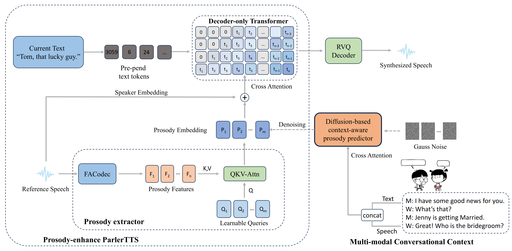

<h2 id = "1">Abstract</h2>
Conversational speech synthesis (CSS) aims to synthesize both contextually appropriate and expressive speech, and considerable efforts have been made to enhance the understanding of conversational context. However, existing CSS systems are limited to deterministic prediction, overlooking the diversity of potential responses. Moreover, they rarely employ language model (LM)-based TTS backbones, limiting the naturalness and quality of synthesized speech. To address these issues, in this paper, we propose DiffCSS, an innovative CSS framework that leverages diffusion models and an LM-based TTS backbone to generate diverse, expressive, and contextually coherent speech. A diffusion-based context-aware prosody predictor is proposed to sample diverse prosody embeddings conditioned on multimodal conversational context. Then a prosody-controllable LM-based TTS backbone is developed to synthesize high-quality speech with sampled prosody embeddings. Experimental results demonstrate that the synthesized speech from DiffCSS is more diverse, contextually coherent, and expressive than existing CSS systems

    
	
    
     
    
 
    <b>Fig.1</b>: Overall architecture of the proposed CSS framework
    

## Expressiveness and contextual coherence

We compare the synthesized speech generated by the proposed method with baseline models to highlight improvements in expressiveness and contextual coherence.
### Sample 1
#### Context
W: Umm I don’t want to. 

M: Well, come and talk to me then.

W: Certainly not. 

M: May I turn on the radio then?

<audio controls="controls" src="./data/context/5_1_d2536.wav" type="audio/wav"></audio>

#### Current utterance
W: Turn on the radio? What for?

#### Synthesized speech

| GRU-based context modeling | DialogueGCN-based context modeling | Transformer encoder-based context modeling | Proposed |
| :--: | :--: | :--: | :--: |
| "Turn on the radio? What for?" | "Turn on the radio? What for?" | "Turn on the radio? What for?" | "Turn on the radio? What for?" |
| <audio controls><source src="./data/gru/5_1_d2536.wav" type="audio/wav"></audio> | <audio controls><source src="./data/dialoguegcn/5_1_d2536.wav" type="audio/wav"></audio> | <audio controls><source src="./data/encoder/5_1_d2536.wav" type="audio/wav"></audio> | <audio controls><source src="./data/diffcss/5_1_d2536.wav" type="audio/wav"></audio> |

### Sample 2
#### Context
M: Umm, where did you go yesterday?

W: I went to Croydon.

M: Did you go shopping?

W: No, I went for an interview.

<audio controls="controls" src="./data/context/4_0_d2522.wav" type="audio/wav"></audio>

#### Current utterance
M: Oh, did you get a job?  

#### Synthesized speech

| GRU-based context modeling | DialogueGCN-based context modeling | Transformer encoder-based context modeling | Proposed |
| :--: | :--: | :--: | :--: |
| "Oh, did you get a job?" | "Oh, did you get a job? " | "Oh, did you get a job? " | "Oh, did you get a job? " |
| <audio controls><source src="./data/gru/4_0_d2522.wav" type="audio/wav"></audio> | <audio controls><source src="./data/dialoguegcn/4_0_d2522.wav" type="audio/wav"></audio> | <audio controls><source src="./data/encoder/4_0_d2522.wav" type="audio/wav"></audio> | <audio controls><source src="./data/diffcss/4_0_d2522.wav" type="audio/wav"></audio> |

### Sample 3
#### Context
M: You have a pet lizard? Somehow I never would have imagined that.

W: His name is Grunt. Come closer and I'll properly introduce you.

M: Does it bite or scratch?

W: No, he's perfectly harmless. And he's not afraid of strangers either. Here, hold him.

<audio controls="controls" src="./data/context/6_0_d2409.wav" type="audio/wav"></audio>

#### Current utterance
M: Wow. He's heavy! And his skin feels really cool.

#### Synthesized speech

| GRU-based context modeling | DialogueGCN-based context modeling | Transformer encoder-based context modeling | Proposed |
| :--: | :--: | :--: | :--: |
| "Well, that's reasonable. I'll take it." | "Well, that's reasonable. I'll take it." | "Well, that's reasonable. I'll take it." | "Well, that's reasonable. I'll take it." |
| <audio controls><source src="./data/gru/6_0_d2409.wav" type="audio/wav"></audio> | <audio controls><source src="./data/dialoguegcn/6_0_d2409.wav" type="audio/wav"></audio> | <audio controls><source src="./data/encoder/6_0_d2409.wav" type="audio/wav"></audio> | <audio controls><source src="./data/diffcss/6_0_d2409.wav" type="audio/wav"></audio> |

### Sample 4
#### Context
W: That sounds good. Let me see one.

M: Here's the latest model — Digital Barbie.

W: Oh, she's nice. How much is she?

M: Why, she's only twenty nine ninety five dollars.

<audio controls="controls" src="./data/context/6_1_d2444.wav" type="audio/wav"></audio>

#### Current utterance
W: Well, that's reasonable. I'll take it.

#### Synthesized speech

| GRU-based context modeling | DialogueGCN-based context modeling | Transformer encoder-based context modeling | Proposed |
| :--: | :--: | :--: | :--: |
| "Well, that's reasonable. I'll take it." | "Well, that's reasonable. I'll take it." | "Well, that's reasonable. I'll take it." | "Well, that's reasonable. I'll take it." |
| <audio controls><source src="./data/gru/6_1_d2444.wav" type="audio/wav"></audio> | <audio controls><source src="./data/dialoguegcn/6_1_d2444.wav" type="audio/wav"></audio> | <audio controls><source src="./data/encoder/6_1_d2444.wav" type="audio/wav"></audio> | <audio controls><source src="./data/diffcss/6_1_d2444.wav" type="audio/wav"></audio> |

### Sample 5
#### Context
W: No, that won’t do. I’ll take this smoked ham you have here. 

M: OK, umm is there anything else?

W: Is this salami and bologna you have here?

M: Yes! It’s very fine meat! Made it myself...

<audio controls="controls" src="./data/context/9_1_d2418.wav" type="audio/wav"></audio>

#### Current utterance
W: Sounds good. OK, that’s it.

#### Synthesized speech

| GRU-based context modeling | DialogueGCN-based context modeling | Transformer encoder-based context modeling | Proposed |
| :--: | :--: | :--: | :--: |
| "Sounds good. OK, that’s it." | "Sounds good. OK, that’s it." | "Sounds good. OK, that’s it." | "Sounds good. OK, that’s it." |
| <audio controls><source src="./data/gru/9_1_d2418.wav" type="audio/wav"></audio> | <audio controls><source src="./data/dialoguegcn/9_1_d2418.wav" type="audio/wav"></audio> | <audio controls><source src="./data/encoder/9_1_d2418.wav" type="audio/wav"></audio> | <audio controls><source src="./data/diffcss/9_1_d2418.wav" type="audio/wav"></audio> |

### Sample 6
#### Context
W: Hey, look out!

M: What happened?

W: You've just scratched my car. Oh, God, a paint was scratched off.

M: Where? my car?

<audio controls="controls" src="./data/context/4_1_d2517.wav" type="audio/wav"></audio>

#### Current utterance
W: No, mine!

#### Synthesized speech

| GRU-based context modeling | DialogueGCN-based context modeling | Transformer encoder-based context modeling | Proposed |
| :--: | :--: | :--: | :--: |
| "No, mine!" | "No, mine!" | "No, mine!" | "No, mine!" |
| <audio controls><source src="./data/gru/4_1_d2517.wav" type="audio/wav"></audio> | <audio controls><source src="./data/dialoguegcn/4_1_d2517.wav" type="audio/wav"></audio> | <audio controls><source src="./data/encoder/4_1_d2517.wav" type="audio/wav"></audio> | <audio controls><source src="./data/diffcss/4_1_d2517.wav" type="audio/wav"></audio> |

### Diversity

We demonstrate the diversity of the proposed method by sampling prosody embeddings multiple times from the same conversational context. As shown in the table below, the predicted prosody varies across different runs, resulting in diverse synthesized speech. At the same time, the predicted prosody remains consistent with the dialog context while maintaining strong expressiveness.

| GRU-based context modeling | DialogueGCN-based context modeling | Transformer encoder-based context modeling | Proposed |
| :--: | :--: | :--: | :--: |
| "No, mine!" | "No, mine!" | "No, mine!" | "No, mine!" |
| <audio controls><source src="./data/gru/4_1_d2517.wav" type="audio/wav"></audio> | <audio controls><source src="./data/dialoguegcn/4_1_d2517.wav" type="audio/wav"></audio> | <audio controls><source src="./data/encoder/4_1_d2517.wav" type="audio/wav"></audio> | <audio controls><source src="./data/diffcss/4_1_d2517.wav" type="audio/wav"></audio> |

